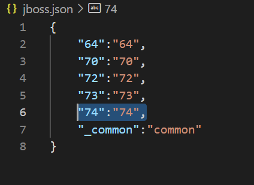

# read_defaults.py
Lo scopo dello script è restituire in formato **json** una delle configurazioni **.yaml** al percorso:

**/spimi/progetti/ansible/provision/group_vars/nomefile.yaml**
## Parametri
Lo script, invocabile anche da altri algoritmi .py deve ricevere almeno tre parametri obbligatori.

**service_type**: valori accettati :java/openjdk/adoptjdk/jboss/weblogic/httpd
  
**version**: per vedere i valori accettati, guardare il file .json con lo stesso nome del service_type selezionato.

**is_admin**: true/false (obbligatoriobl, enforcbled from list)

Parametri opzionali:

**hostname**: campo libero, per indicare più macchine host passargli il parametro separati dal carattere virgola , 

**acronimo**: campo libero 

## Esempio di call
    $ python read_defaults.py --service_type=jboss --version=73 --hostname=salclp123,salclp456,salclp789  --acronimo=tlla0 --is_admin=False

Restituisce in output:

    {"jboss_version": "7.3", "patching_level": "10", "ap_user": "jboss7", "jboss_passwd": "{{ vault_jboss7_passwd }}", "jdk_cli_version": "11.0","instances": [{"hostname": "salclp123","instance-name": "tlla0Server123"},{"hostname": "salclp456","instance-name": "tlla0Server456"},{"hostname": "salclp789","instance-name": "tlla0Server789"}]}

## Manutenzione del job read_defaults su Rundeck

In caso venga rilasciata una nuova configurazione nella sezione group_vars:

1)In caso di nuovo service_type, va modifica l'opzione omonima nella scheda.

 edit job > workflow > edit sulla option > allowed values 

 
 
2)In caso di nuova versione di un service_type esiststente, va aggiunta nel file .json del servizio. 
 Esempio con un eventuale aggiunta di Jboss 7.4:

 
 
 Per rendere più parlante il menu su rundeck, lasciare chiave e valore con la stessa stringa.
